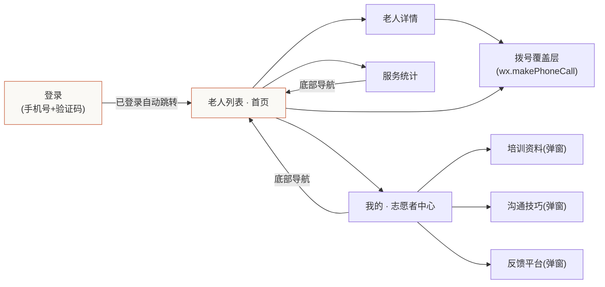
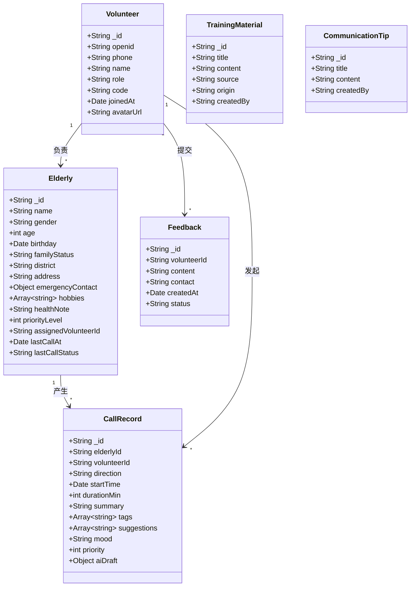
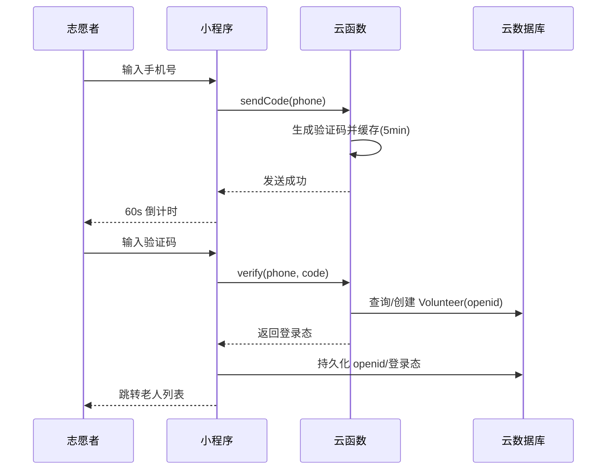
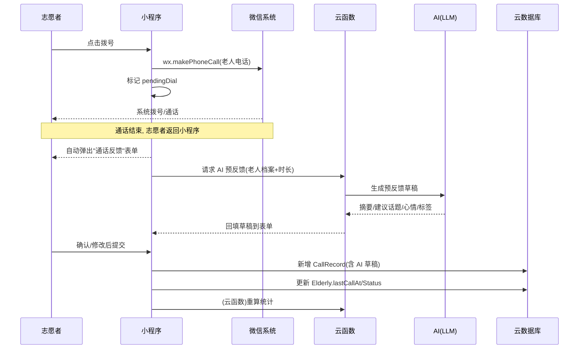
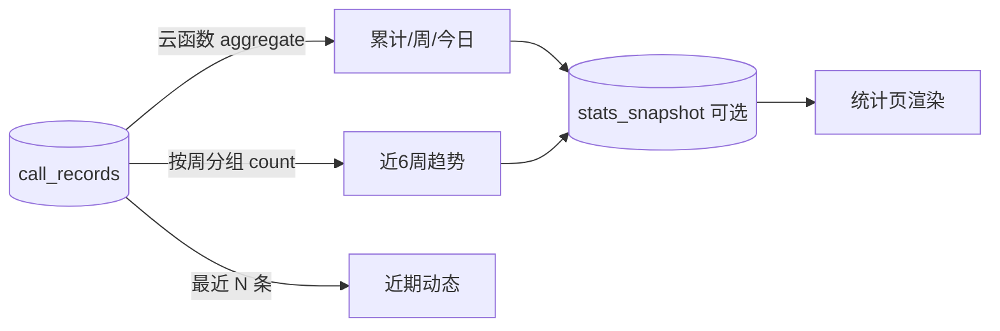
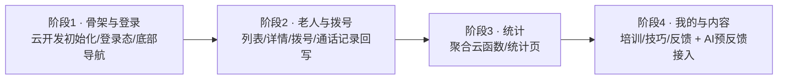

# 暖心通话 · 微信小程序设计文档（V0.2 设计稿 · 待对齐）

> 本文档基于 `C:\ws\prototype` 目录下的界面原型（核心 6 个 HTML 页面）整理，用于**先对齐需求与设计，再进入实现**。
> 技术选型：微信小程序 + 微信云开发（云数据库 / 云函数 / 云存储），本期**不做独立后台**。
> 原型对应页面：`index.html`（总览）、`screen-login.html`、`screen-contacts.html`、`screen-contact-detail.html`、`screen-stats.html`、`screen-volunteer.html`。
> 注：`screen-incoming-call.html` 本次需求已确认**不使用** —— 本期不做老人来电/接听，通话方向仅为"志愿者拨出"。

---

## 1. 项目背景与目标

**暖心通话** 是一款面向 **志愿者** 的工具型小程序，用于规模化关怀 **失独老人**（失去唯一子女、多独居、存在情感陪伴需求）。核心价值：

- 让志愿者快速找到负责的老人、一键拨号、了解上次沟通要点；
- 通话前提供 **"建议聊天话题"**，降低沟通门槛；
- 自动沉淀 **通话记录 / 服务反馈 / 服务统计**，形成可持续的陪伴闭环。

**本期目标（MVP）**：把原型里的核心界面跑通为真实小程序，数据落到微信云数据库，登录/拨号/通话反馈/统计可用。**本期不含老人来电/接听功能，通话方向仅为"志愿者拨出"。**

---

## 2. 角色与用户

| 角色 | 说明 | 使用端 |
|------|------|--------|
| 志愿者 | 实际拨打电话、记录通话、查看统计的人 | 小程序（主端） |
| 失独老人 | 被关怀对象，**不使用本小程序**，仅通过电话被联系 | 普通电话 |
| （本期无）管理员 / 后台 | 老人档案录入、团队管理 | 暂不做，改由云控制台或种子数据 |

> 本期通话方向仅为 **志愿者主动拨出**；小程序不做来电接听（老人来电功能已确认不做）。

---

## 3. 信息架构与导航



**导航结构**：底部三 Tab（联系人 / 统计 / 我的）贯穿主流程；登录页为全屏独立页。本期无来电页。

---

## 4. 功能清单（需求地图 · 含优先级）

优先级：🔴 P0 必须（MVP）｜🟡 P1 重要（MVP 可简化）｜🔵 P2 增强（后续）

| # | 功能 | 原型出处 | 优先级 | 备注 |
|---|------|----------|--------|------|
| F01 | 手机号+验证码登录、登录态保持、退出 | login | 🔴 P0 | 验证码实现方式待定（§9-1） |
| F02 | 老人列表：搜索、按状态筛选（全部/今日已联系/需优先关怀） | contacts | 🔴 P0 | 需优先关怀=超期未联系或 priority=1 |
| F03 | 联系人卡片展开：上次通话摘要 / 标签 / 建议话题 | contacts | 🔴 P0 | 建议话题来源待定（§9-2） |
| F04 | 一键拨号（拉起系统电话） | contacts / detail | 🔴 P0 | 用 `wx.makePhoneCall` |
| F05 | 老人详情：基本信息 / 爱好(可增删) / 最近通话 / 建议话题 / 拨号 | detail | 🔴 P0 | |
| F06 | 通话反馈表单（时长/摘要/标签/建议/心情，**AI 预填辅助**），打完电话自动弹出 | —— | 🔴 P0 | **原型缺失，需新增**（§5.4） |
| F07 | 服务统计：累计/本周/今日/近6周趋势/近期动态 | stats | 🔴 P0 | 数据来自 CallRecord 聚合 |
| F08 | 我的：志愿者资料卡、培训资料、沟通技巧、帮助反馈 | volunteer | 🟡 P1 | 资料/技巧为可编辑内容（原 localStorage → 云库） |
| F09 | 培训资料：增删改查 + 关键词搜索 + 在线参考库 | volunteer | 🟡 P1 | 在线库本期可先内置静态数据 |
| F10 | 沟通技巧：增删改查 + 搜索 | volunteer | 🟡 P1 | |
| F11 | 帮助与反馈提交 | volunteer | 🔵 P2 | |
| F12 | 登录后自动重定向、全局登出 | login | 🔴 P0 | |

---

## 5. 页面级功能设计

### 5.1 登录页（`screen-login.html`）
- 手机号输入（+86 前缀、11 位校验 `^1\d{10}$`）。
- "发送验证码"→ 60s 倒计时；验证码 6 位，自动尝试登录。
- 已登录则直接进入老人列表（原型用 `localStorage`，上线用云登录态）。
- 底部协议勾选（用户协议 / 隐私政策）。
- 退出登录清除登录态。

### 5.2 老人列表 · 首页（`screen-contacts.html`）
- 顶部：标题 + 志愿者名 + 搜索 / 筛选 / 退出 图标。
- 搜索框：按姓名、地址、爱好模糊搜索。
- 三个快捷统计卡（可点击切换筛选）：在册老人 12 / 今日已联系 8 / 需优先关怀 2。
- 联系人列表：头像（女=暖橙 `#c96442`、男=灰 `#5e5d59`）、年龄+独居区、联系状态徽标（今天联系过=绿 / 超期=红）、拨号按钮（脉冲动画）。
- 点击卡片展开：上次通话摘要 + 标签 + 建议话题（1/2/3）+ "查看完整资料"。
- 拨号覆盖层：全屏"正在呼叫"+ 挂断。

### 5.3 老人详情（`screen-contact-detail.html`）
- 头部：头像/姓名/年龄+独居区/联系状态/（需优先关怀 红标）。
- 基本信息：出生日期、家庭成员、居住地址、紧急联系人、兴趣爱好、健康状况。
- 兴趣爱好：可删除 chip + "添加爱好" 输入框（本期存云库）。
- 最近通话：**从数据库读取并按 startTime 倒序，仅展示最近 3 条**（日期/时长/摘要/标签）；超过 3 条时本期仅展示最近 3 条（"查看全部"预留）。
- 本次建议聊天内容：3 条编号建议。
- 底部通话栏：拨号（主按钮）+ 发消息（占位，本期可隐藏或留空）。

### 5.4 拨号与通话反馈（⚠️ 关键新增 · AI 辅助预填）

原型只演示了"拨号覆盖层"和"已存在的通话摘要"，**没有"打完电话后填写记录"的界面**。根据最新需求，调整为：**志愿者拨号 → 通话结束返回小程序 → 自动弹出"通话反馈"表单 → AI 预填辅助 → 志愿者确认/修改 → 提交入库**（通话记录落 `call_records`，详情页只展示最近 3 条）。

```mermaid
flowchart TD
  A[点击拨号] --> B[wx.makePhoneCall 拉起系统电话]
  B --> C[志愿者通话结束, 返回小程序]
  C --> D[自动弹出"通话反馈"表单]
  D --> E[云函数调用 AI 生成"预反馈"草稿<br/>摘要/建议话题/心情/标签 预填]
  E --> F{志愿者确认或修改}
  F -->|确认/微调| G[提交 → 新增 CallRecord<br/>含 AI 草稿一并保存]
  G --> H[更新 Elderly.lastCallAt/priority]
  H --> I[触发统计重算 云函数]
  F -->|放弃| J[不写记录 返回详情]
```

**表单字段**：通话方向（固定为 `out`，志愿者拨出）、开始时间（自动）、时长（分钟，可改）、通话摘要、心情（良好/一般/低落）、标签（多选）、下次建议话题、**AI 预反馈草稿（可编辑）**。

> 🤖 **AI 预反馈**：通话结束后，云函数将老人档案（爱好/健康/上次摘要）+ 通话基础信息（时长）送入 LLM，生成一段"预反馈"（通话要点总结 + 下次建议话题 + 心情/标签建议），回填到表单供志愿者确认/修改。LLM 选型与调用方式见 §9-3。
>
> ⚠️ **弹出时机**：`wx.makePhoneCall` 仅拉起系统拨号并返回 success，**无法感知真实通话结束**。方案建议：拨号 success 后标记 `pendingDial`，志愿者回到小程序即自动弹出反馈表单（详见 §9-6）。

### 5.5 服务统计（`screen-stats.html`）
- 累计服务：累计通话 328 / 服务时长 87.5h / 覆盖老人 12。
- 本周情况：本周通话 6 / 时长 2.5h / 覆盖 5。
- 今日动态：已联系 8 / 时长 1h12m / 需优先关怀 2 / 连续服务 15 天。
- 近 6 周通话趋势：条形图（调用次数）。
- 近期动态：通话流水（out/in/urgent 不同色点）。
- 顶部刷新按钮（真实实现调用聚合云函数）。

### 5.6 我的 / 志愿者中心（`screen-volunteer.html`）
- 志愿者资料卡：姓名、星级/年限、志愿者编号、编辑入口。
- 设置与工具菜单：
  - 培训资料：弹窗内列表 + 搜索 + 新增/编辑/删除 + "联网搜索更多"（本期内置静态参考库）。
  - 沟通技巧：弹窗内列表 + 搜索 + 增删改。
  - 帮助与反馈：联系信息 + 反馈文本 + 提交。
  - 退出登录。

> 原型用 `localStorage` 存培训资料/技巧/爱好；上线需迁移到云数据库，并明确**全局共享 vs 志愿者私有**（§9-4）。

---

## 6. 数据模型设计（微信云数据库）

云数据库为文档型（Collection + Document），以下用 UML 类图表达实体与关系，字段名即云端 `field` 名。



**集合说明**

| 集合 | 用途 | 关键索引/权限 |
|------|------|----------------|
| `volunteers` | 志愿者档案与登录态 | openid 唯一；本人可读写 |
| `elderly` | 老人档案（演示用种子数据） | 按 assignedVolunteerId 查询；读权限待定 |
| `call_records` | 通话记录（统计与详情来源） | elderlyId、volunteerId、startTime 索引 |
| `training_materials` | 培训资料 | 全局可读；写权限待定（§9-4） |
| `communication_tips` | 沟通技巧 | 同上 |
| `feedbacks` | 反馈 | 志愿者本人写 |

> 统计数字（累计/周/趋势）由 `call_records` **聚合**得到，建议封装为云函数（`aggregate`）或定时快照集合 `stats_snapshot` 提升性能。

---

## 7. 关键业务流程

### 7.1 登录鉴权


### 7.2 拨打电话与通话反馈


### 7.3 统计聚合


---

## 8. 技术架构（微信云开发）

```mermaid
flowchart TB
  subgraph 小程序端
    P[页面 Pages] --> C[自定义组件 Components]
    C --> A[wx.login / wx.makePhoneCall / 存储 API]
  end
  subgraph 微信云开发
    CF[云函数 Cloud Functions] --> DB[(云数据库)]
    CF --> SMS[短信/手机号能力]
    ST[云存储] --> F[头像/资料附件]
  end
  P -->|callFunction| CF
  P -->|数据库读写(带安全规则)| DB
  P -->|uploadFile| ST

  style DB fill:#eef6ff,stroke:#3898ec
  style CF fill:#faf9f5,stroke:#c96442
```

**技术要点**
- 登录：`wx.login` 拿 `code` → 云函数换 `openid`；验证码方案见 §9-1。
- 拨号：仅 `wx.makePhoneCall`，小程序本身不做通话编解码。
- 数据库权限：默认"仅创建者可读写"，团队共享数据需改用 **云函数代理** 或自定义安全规则。
- 聚合统计：用云函数 `db.collection('call_records').aggregate()`。

---

## 9. 待对齐的关键决策（Open Questions ❓）

> 以下是影响实现方案的分叉点，请逐条确认，确认后我再出实现计划。
> **已确认（来自 2026-07-11 反馈）**：❌ 不做老人来电/接听（仅志愿者拨出）；📝 通话记录存库、详情页仅展示最近 3 条；🤖 通话结束弹出反馈表单、AI 辅助预填。

1. **登录方式**：
   - (A) 短信验证码 —— 需云开发短信能力或第三方（有成本、需资质）；
   - (B) 微信手机号一键登录（`button open-type="getPhoneNumber"` + 云函数解密）—— 无短信成本、体验好。**建议 B**，原型验证码 UI 可保留为"绑定/校验"场景。

2. **「建议聊天话题」来源（通话前展示，见 §5.3）**：
   - (A) 志愿者**手动填写**历史建议；
   - (B) 内置**模板/标签**自动带出；
   - (C) **AI 生成**（需 LLM 云函数）。
   - 原型为硬编码，建议本期用 (A)+(B) 组合；通话后的"下次建议话题"由 AI 预反馈产出（见 §5.4）。

3. **AI 预反馈的 LLM 选型与接入方式**（新增 · 关键）：
   - 通话结束后的"AI 预反馈"需要 LLM 能力。可选：腾讯云 **混元（Hunyuan）** 大模型、其它云 LLM、或预留接口。
   - 是否本期即接入真实 LLM，还是先用**规则/模板模拟 AI 草稿**（保证主流程跑通、后续替换）？**建议本期先接混元（云开发可直接调用），同时保留规则兜底。**

4. **培训资料 / 沟通技巧 / 爱好**的归属：
   - 全局共享（所有志愿者可见同一套） vs 志愿者私有？影响数据库权限与读写设计。**建议全局共享 + 志愿者可贡献**。

5. **老人档案数据来源**：本期不做后台，老人数据如何进库？
   - 演示：云函数种子脚本灌入；
   - 生产：云控制台手动录入 或 预留一个"老人录入"内部页（不在志愿者端）。

6. **通话结束如何精准弹出反馈表单**（新增）：
   - `wx.makePhoneCall` 仅拉起系统拨号并返回 success，无法感知真实通话结束。方案：
     - (A) 拨号 success 后立即弹出（志愿者可能在通话中返回，偏早）；
     - (B) 拨号 success 后，由志愿者在详情页主动点"记录本次通话"再弹；
     - (C) 拨号 success 后置 `pendingDial` 标记，志愿者回到小程序即自动弹出。
   - **建议 (C)**：拨号后标记，返回小程序自动弹出反馈表单，最贴合"打完电话就弹表"的诉求。

7. **拨号对象确认**：老人详情页原型只显示"紧急联系人电话"，未显示**老人本人手机号**。拨号应打给老人本人——需补充老人 `phone` 字段。

8. **统计口径**：累计 328 通等为演示值，真实需聚合；是否需"个人统计"与"团队统计"区分？多志愿者是否共享同一批老人？

---

## 10. 实现路线建议（分期）



- **阶段 1（P0 基础）**：云开发环境、登录（建议方案 B）、三个 Tab 框架、退出登录。
- **阶段 2（P0 核心）**：老人列表（搜索/筛选）、详情（含最近 3 条通话）、拨号、通话反馈表单（AI 辅助预填，新增 §5.4）。
- **阶段 3（P0 数据）**：统计聚合云函数 + 统计页渲染。
- **阶段 4（P1/P2）**：我的中心、培训/技巧 CRUD、反馈；**AI 预反馈云函数接入（按 §9-3）**；通话结束弹出反馈表单（按 §9-6）。

---

## 附录：原型 → 设计映射速查

| 原型文件 | 对应设计章节 | 核心功能 |
|----------|--------------|----------|
| `index.html` | §3 | 总览/入口 |
| `screen-login.html` | §5.1 | 登录 |
| `screen-contacts.html` | §5.2 | 老人列表/搜索/筛选/展开 |
| `screen-contact-detail.html` | §5.3 | 老人详情/爱好编辑（含最近 3 条通话） |
| （缺失） | §5.4 | **通话反馈表单（AI 辅助预填，新增）** |
| `screen-stats.html` | §5.5 | 服务统计 |
| `screen-volunteer.html` | §5.6 | 我的/培训/技巧/反馈 |

---
*文档版本 V0.2 · 依据 2026-07-11 用户反馈修订（移除老人来电、详情页仅展示最近 3 条通话、通话结束弹出 AI 辅助反馈表单） · 等待 §9 决策点确认后进入实现。*
