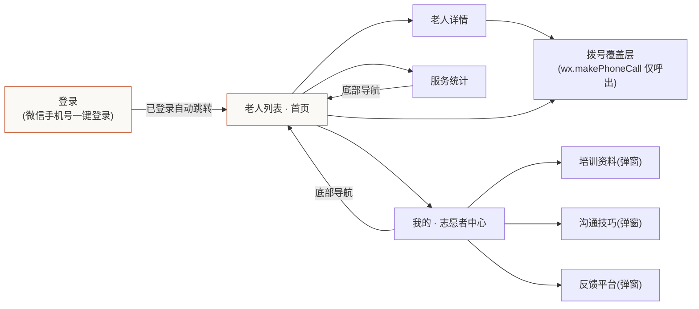
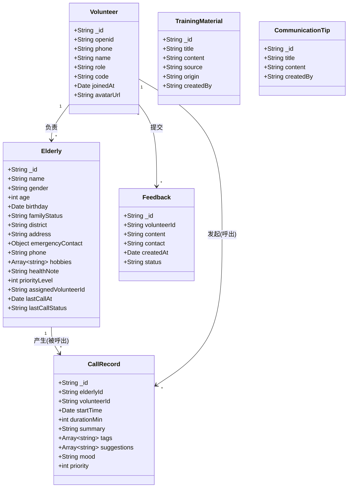
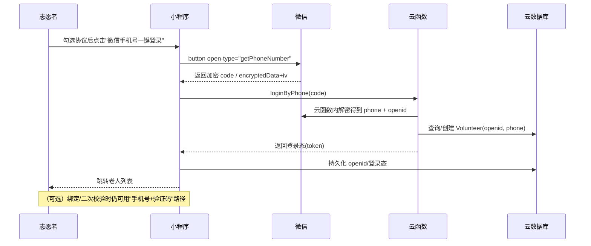
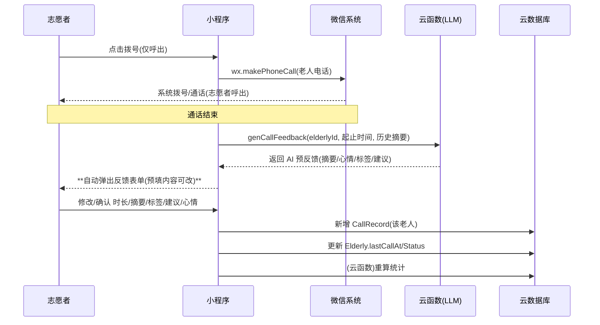
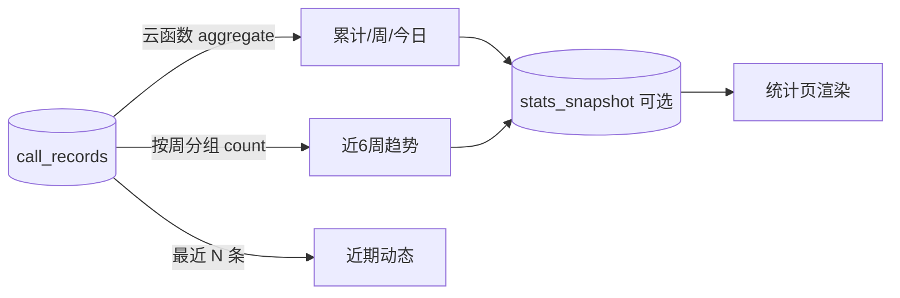
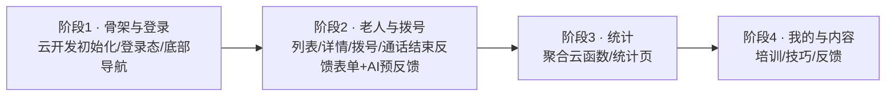

# 暖心通话 · 微信小程序设计文档（V0.3 决策已确认 · 可进入实现）

> 本文档基于 `D:\前端1` 目录下的界面原型整理（原 7 个 HTML 页面，已移除"老人来电"页，剩余 6 个）；需求与设计已对齐、§9 决策已确认，**可进入实现**。
> 技术选型：微信小程序 + 微信云开发（云数据库 / 云函数 / 云存储），本期**不做独立后台**（AI 预反馈通过云函数调用 **DeepSeek** API 实现，详见 §9-2 / §11.3）。
> 原型对应页面：`index.html`（总览）、`screen-login.html`、`screen-contacts.html`、`screen-contact-detail.html`、`screen-stats.html`、`screen-volunteer.html`。
>
> **本次修订（V0.2 三方反馈）**：① 彻底去除"老人来电 / 双向通话"概念，仅保留志愿者单向拨号；② 通话记录落库，老人详情页只展示最近 3 条；③ 通话结束即弹窗反馈表单，AI 做预反馈辅助。上述三项已写入正文并标记为"已确认"。**V0.3 决策轮**中 §9 其余 6 项分叉点（登录方式 / AI 兜底 / 内容归属 / 老人录入 / 呼出号码 / 统计口径）已全部确认，详见 §9 与各章节内联标注。

---

## 1. 项目背景与目标

**暖心通话** 是一款面向 **志愿者** 的工具型小程序，用于规模化关怀 **失独老人**（失去唯一子女、多独居、存在情感陪伴需求）。核心价值：

- 让志愿者快速找到负责的老人、一键拨号、了解上次沟通要点；
- 通话前提供 **"建议聊天话题"**，降低沟通门槛；
- 自动沉淀 **通话记录 / 服务统计**，形成可持续的陪伴闭环；

**通话模型（明确单向 · 已确认）**：本期为**严格单向通话**——**只有志愿者主动拨号给老人**，**不存在"老人来电 / 来电提醒 / 接听"任何功能与界面**。老人始终是被呼叫方，通过普通电话接听，不安装、不使用本小程序，也无任何主动发起入口。

**本期目标（MVP）**：把原型里的 6 个界面跑通为真实小程序，数据落到微信云数据库，登录/拨号/统计/通话反馈可用。

---

## 2. 角色与用户

| 角色 | 说明 | 使用端 |
|------|------|--------|
| 志愿者 | 实际拨打电话、记录通话、查看统计的人 | 小程序（主端） |
| 失独老人 | 被关怀对象，**不使用本小程序**，仅通过电话被志愿者联系 | 普通电话（仅接听） |
| （本期无）管理员 / 后台 | 老人档案录入、团队管理 | 暂不做独立后台；生产用**云控制台手动录入**，或预留**"老人录入"内部页**（不在志愿者端，§9-4 已确认） |

> 本期**不存在任何"老人主动来电"的角色动作或界面**，所有通话均由志愿者侧发起。

---

## 3. 信息架构与导航



**导航结构**：底部三 Tab（联系人 / 统计 / 我的）贯穿主流程；登录页为全屏独立页。**无"来电 / 通话接听"页。**

---

## 4. 功能清单（需求地图 · 含优先级）

优先级：🔴 P0 必须（MVP）｜🟡 P1 重要（MVP 可简化）｜🔵 P2 增强（后续）

| # | 功能 | 原型出处 | 优先级 | 备注 |
|---|------|----------|--------|------|
| F01 | 微信手机号一键登录（`getPhoneNumber`）、登录态保持、退出 | login | 🔴 P0 | 微信手机号一键登录（§9-1 已确认） |
| F02 | 老人列表：搜索、按状态筛选（全部/今日已联系/需优先关怀） | contacts | 🔴 P0 | 需优先关怀=超期未联系或 priority=1 |
| F03 | 联系人卡片展开：上次通话摘要 / 标签 / 建议话题 | contacts | 🔴 P0 | 建议话题生成策略待定（§9-2） |
| F04 | 一键拨号（**仅呼出**，拉起系统电话） | contacts / detail | 🔴 P0 | 用 `wx.makePhoneCall`，无接听/来电逻辑 |
| F05 | 老人详情：基本信息 / 爱好(可增删) / **最近通话(仅3条，来自数据库)** / 建议话题 / 拨号 | detail | 🔴 P0 | 仅展示 `call_records` 最近 3 条（§5.3） |
| F06 | **通话结束即弹出反馈表单**（时长/摘要/标签/建议/心情）+ AI 预反馈 | —— | 🔴 P0 | **原型缺失，需新增**（§5.4，已确认纳入本期） |
| F07 | 服务统计：累计/本周/今日/近6周趋势/近期动态 | stats | 🔴 P0 | 数据来自 CallRecord 聚合 |
| F08 | 我的：志愿者资料卡、培训资料、沟通技巧、帮助反馈 | volunteer | 🟡 P1 | 资料/技巧为可编辑内容（原 localStorage → 云库） |
| F09 | 培训资料：增删改查 + 关键词搜索 + 在线参考库 | volunteer | 🟡 P1 | 在线库本期可先内置静态数据 |
| F10 | 沟通技巧：增删改查 + 搜索 | volunteer | 🟡 P1 | |
| F11 | 反馈平台提交 | volunteer | 🔵 P2 | |
| F12 | 登录后自动重定向、全局登出 | login | 🔴 P0 | |

> 已确认：**没有"老人来电""接听来电""来电提醒"相关功能（F04 单向呼出，无 in 方向）。**

---

## 5. 页面级功能设计

### 5.1 登录页（`screen-login.html`）
- **主登录路径：微信手机号一键登录** —— `button open-type="getPhoneNumber"` 拉起授权，云函数解密得到手机号 + `openid`，自动创建/匹配 `volunteer` 并写登录态（§9-1 已确认）。
- 底部协议勾选（用户协议 / 隐私政策），勾选后方可点击授权登录。
- 已登录则直接进入老人列表（原型用 `localStorage`，上线用云登录态）。
- **保留"手机号+验证码"UI 作为可选的绑定/二次校验场景**（非主路径）：输入手机号 → "发送验证码"→ 60s 倒计时 → 验证码 6 位校验。
- 退出登录清除登录态。

### 5.2 老人列表 · 首页（`screen-contacts.html`）
- 顶部：标题 + 志愿者名 + 搜索 / 筛选 / 退出 图标。
- 搜索框：按姓名、地址、爱好模糊搜索。
- 三个快捷统计卡（可点击切换筛选）：在册老人 12 / 今日已联系 8 / 需优先关怀 2。
- 联系人列表：头像（女=暖橙 `#c96442`、男=灰 `#5e5d59`）、年龄+独居区、联系状态徽标（今天联系过=绿 / 超期=红）、拨号按钮（脉冲动画）。
- 点击卡片展开：上次通话摘要（仅最新一条） + 标签 + 建议话题（1/2/3）+ "查看完整资料"。
- 拨号覆盖层：全屏"正在呼叫"+ 挂断（**呼出覆盖层，非来电接听**）。

### 5.3 老人详情（`screen-contact-detail.html`）
- 头部：头像/姓名/年龄+独居区/联系状态/（需优先关怀 红标）。
- 基本信息：出生日期、家庭成员、居住地址、紧急联系人（仅展示/备用，**不用于拨号**）、兴趣爱好、健康状况。
- **拨号号码**：使用 `Elderly.phone`（老人本人手机号，**必填**，§9-5 已确认），底部主按钮仅呼出该号码。
- 兴趣爱好：可删除 chip + "添加爱好" 输入框（本期存云库）。
- **最近通话（已确认 · 仅 3 条）**：**只展示数据库（`call_records`）中该老人最近 3 条记录**（查询口径：按 `elderlyId + startTime` 倒序 `limit 3`），每条含 日期 / 时长 / 摘要 / 标签。**更早的历史不在本页展示**（可在统计页"近期动态"汇总查看）。
- 本次建议聊天内容：3 条编号建议。
- 底部通话栏：拨号（主按钮，仅呼出）+ 发消息（占位，本期可隐藏或留空）。

### 5.4 通话结束后的反馈与记录（⚠️ 新增 + AI 预反馈 · 已确认）

原型只演示了"拨号覆盖层"和"已存在的通话摘要"，**没有提供创建一条通话记录的界面**。真实使用时必须补一个流程：**志愿者拨号结束（接通并完成通话）后，立即自动弹出"记录本次通话"反馈表单**，由志愿者对本次通话进行反馈；AI 会先生成预反馈草稿辅助填写，志愿者可逐项修改后提交。

```mermaid
flowchart TD
  A[志愿者点击拨号] --> B[wx.makePhoneCall 拉起系统电话<br/>仅呼出]
  B --> C{志愿者是否接通并结束通话?}
  C -->|是| D[云函数调用 DeepSeek 生成"AI 预反馈"<br/>预填: 摘要/心情/标签/建议话题]
  D --> E[**自动弹出"记录本次通话"反馈表单**<br/>预填内容可直接编辑修改]
  E --> F[志愿者修改/确认 → 提交<br/>新增 CallRecord(该老人)]
  F --> G[更新 Elderly.lastCallAt/Status]
  G --> H[触发统计重算 云函数]
  C -->|否/取消| I[不写记录 返回列表]
```

**表单字段建议**（无"通话方向"字段，因为始终为志愿者呼出）：开始时间(自动)、时长(分钟)、通话摘要、心情(良好/一般/低落)、标签(多选)、下次建议话题、是否需要优先关怀。

**AI 预反馈（辅助填写，非替代 · 已确认纳入本期）**：
- 通话结束后，前端调用云函数 `genCallFeedback`，入参：`elderlyId`、本次通话起止时间、该老人最近若干条历史 `CallRecord` 摘要。
- 云函数调用 LLM 生成：① 通话摘要草稿；② 心情预判；③ 标签建议；④ 下次建议话题。
- 表单先用上述预填内容渲染，**志愿者可逐项修改 / 补充后**再提交；AI 仅作辅助，最终以人工填写为准。
- 范围说明：DeepSeek 调用通过云函数完成，仍属"云开发"范畴；但需配置 DeepSeek API Key（环境变量注入，见 §11.3 / §11.6），是对原"无独立后台"假设的微调（见 §9-2）。

> 反馈 #3 落实点：**打完电话就会弹出记录表格（反馈表单）**，AI 预反馈作为预填辅助，不替代人工确认。

### 5.5 服务统计（`screen-stats.html`）
- **顶部视角切换：`团队统计`（默认）/ `个人统计`**（§9-6 已确认：区分 + 共享）。个人统计按当前志愿者过滤，团队统计为全员汇总；老人数据共享、不隔离。
- 累计服务：累计通话 328 / 服务时长 87.5h / 覆盖老人 12（团队）或本人口径（个人）。
- 本周情况：本周通话 6 / 时长 2.5h / 覆盖 5。
- 今日动态：已联系 8 / 时长 1h12m / 需优先关怀 2 / 连续服务 15 天。
- 近 6 周通话趋势：条形图（调用次数）。
- 近期动态：通话流水（全部为志愿者呼出记录，不同色点区分状态）。
- 顶部刷新按钮（真实实现调用聚合云函数，按当前视角口径聚合）。

### 5.6 我的 / 志愿者中心（`screen-volunteer.html`）
- 志愿者资料卡：姓名、星级/年限、志愿者编号、编辑入口。
- 设置与工具菜单：
  - 培训资料：弹窗内列表 + 搜索 + 新增/编辑/删除 + "联网搜索更多"（本期内置静态参考库）。
  - 沟通技巧：弹窗内列表 + 搜索 + 增删改。
  - 反馈平台：联系信息 + 反馈文本 + 提交。
  - 退出登录。

> 原型用 `localStorage` 存培训资料/技巧/爱好；上线需迁移到云数据库。**培训资料/沟通技巧/爱好已确认为"全局共享 + 志愿者可贡献"**（§9-3）：一套内容全员可见，任意志愿者的新增/修改经云函数写入并广播；写入走云函数代理而非直写。**老人录入不在志愿者端**（§9-4）。

---

## 6. 数据模型设计（微信云数据库）

云数据库为文档型（Collection + Document），以下用 UML 类图表达实体与关系，字段名即云端 `field` 名。



**集合说明**

| 集合 | 用途 | 关键索引/权限 |
|------|------|----------------|
| `volunteers` | 志愿者档案与登录态 | openid 唯一；本人可读写 |
| `elderly` | 老人档案（演示用种子数据；生产经云控制台或内部录入页） | 按 assignedVolunteerId 查询；读权限：团队共享（志愿者可读）；**`phone` 必填，为老人本人呼出号码**；紧急联系人存 `emergencyContact` 仅展示（§9-4、§9-5 已确认） |
| `call_records` | 通话记录（统计与详情来源） | elderlyId、volunteerId、startTime 索引；详情页按 `elderlyId + startTime desc limit 3` |
| `training_materials` | 培训资料 | **全局共享 + 志愿者可贡献**（§9-3 已确认）：全局可读，写经云函数代理（志愿者可创建/编辑，运营可审核） |
| `communication_tips` | 沟通技巧 | 同上 |
| `feedbacks` | 反馈 | 志愿者本人写 |

> - `CallRecord` **不再保留 `direction` 字段**：本期严格单向，所有记录均为志愿者呼出，方向隐含、无需存储。
> - 统计数字（累计/周/趋势）由 `call_records` **聚合**得到，建议封装为云函数（`aggregate`）或定时快照集合 `stats_snapshot` 提升性能。**聚合需支持"个人统计"（按 `volunteerId` 过滤）与"团队统计"（全量）两种口径**，多志愿者共享同一批老人（§9-6 已确认）。
> - 老人详情页只取最近 3 条（`limit 3`）；统计页"近期动态"取更长流水，二者查询口径不同。

---

## 7. 关键业务流程

### 7.1 登录鉴权（微信手机号一键登录 · 已确认 §9-1）


### 7.2 拨打电话与反馈回写（含 AI 预反馈）


### 7.3 统计聚合


---

## 8. 技术架构（微信云开发）

```mermaid
flowchart TB
  subgraph 小程序端
    P[页面 Pages] --> C[自定义组件 Components]
    C --> A[wx.login / wx.makePhoneCall(仅呼出) / 存储 API]
  end
  subgraph 微信云开发
    CF[云函数 Cloud Functions] --> DB[(云数据库)]
    CF --> SMS[短信/手机号能力]
    CF --> LLM[DeepSeek 能力(通话预反馈)]
    ST[云存储] --> F[头像/资料附件]
  end
  P -->|callFunction| CF
  P -->|数据库读写(带安全规则)| DB
  P -->|uploadFile| ST

  style DB fill:#eef6ff,stroke:#3898ec
  style CF fill:#faf9f5,stroke:#c96442
```

**技术要点**
- 登录：**微信手机号一键登录** —— `button open-type="getPhoneNumber"` 拿加密参数，云函数解密得 `phone` + `openid`，创建/匹配 `volunteer` 并下发登录态（§9-1 已确认）。`wx.login` 仅用于换取 `openid` 的底层链路。
- 拨号：仅 `wx.makePhoneCall`，**只做呼出**，小程序本身不做通话编解码，也**不处理任何来电/接听**。
- 数据库权限：默认"仅创建者可读写"，团队共享数据需改用 **云函数代理** 或自定义安全规则。
- 聚合统计：用云函数 `db.collection('call_records').aggregate()`。
- AI 预反馈：云函数内调用 LLM（需配置密钥/能力），仅生成辅助草稿，最终以志愿者提交为准。

---

## 9. 待对齐的关键决策（Open Questions ❓ → 已确认）

> 下列 6 项分叉点已于 **V0.3 决策轮**全部确认（见每条末尾 ✅ 标注）。此前已确认 3 项：单向呼出 / 详情仅 3 条 / 结束弹窗+AI 预反馈。

1. **登录方式**：✅ **采用 (B) 微信手机号一键登录**（`button open-type="getPhoneNumber"` + 云函数解密手机号），无短信成本、体验好。原型"手机号+验证码"UI 保留为可选的"绑定/二次校验"场景，非主登录路径。（正文已同步 §4/F01、§5.1、§7.1、§8）

2. **AI 预反馈兜底**：✅ **保留志愿者手动填写兜底**。AI 预反馈由云函数调用 **DeepSeek API** 生成（密钥用环境变量 `DEEPSEEK_API_KEY` 注入，代码中 `TODO` 占位，不进仓库）；DeepSeek 失败/未配置时，反馈表单仍以空白态可用，志愿者可直接提交，AI 仅作可选辅助。功能与兜底机制已写入 §5.4。

3. **培训资料 / 沟通技巧 / 爱好归属**：✅ **全局共享 + 志愿者可贡献**。所有志愿者可见同一套内容；任意志愿者的新增/修改经云函数写入并广播给全员。权限见 §6 集合说明。（正文已同步 §5.6、§6）

4. **老人档案数据来源**：✅ **云控制台手动录入**（生产首选）；同时**预留一个"老人录入"内部页**，该页**不在志愿者端**，仅内部运营/管理员使用（可置于云开发静态托管或独立管理小程序）。演示期仍用种子脚本灌入。（正文已同步 §6 `elderly`）

5. **老人 `phone` 呼出号码字段**：✅ **确认使用老人本人手机号**，`Elderly.phone` 为**必填**，拨号直接拨打该号码；紧急联系人电话保留于 `emergencyContact` 仅作展示/备用。字段命名与必填性已确认。（正文已同步 §6、§5.3）

6. **统计口径**：✅ **区分 + 共享**：既提供**个人统计**（志愿者本人发起的通话），也提供**团队统计**（全员汇总）；多志愿者**共享同一批老人**（`assignedVolunteerId` 仅用于"我的负责老人"筛选，不隔离数据）。统计页默认团队视角，可切换个人。（正文已同步 §5.5、§6 `StatsSnapshot` 思路）

---

## 10. 实现路线建议（分期）



- **阶段 1（P0 基础）**：云开发环境、登录（微信手机号一键登录，§9-1 已确认）、三个 Tab 框架、退出登录。
- **阶段 2（P0 核心）**：老人列表（搜索/筛选）、详情（**含最近 3 条通话**）、拨号（仅呼出）、**通话结束自动弹出反馈表单 + AI 预反馈**（新增 §5.4）。
- **阶段 3（P0 数据）**：统计聚合云函数 + 统计页渲染。
- **阶段 4（P1/P2）**：我的中心、培训/技巧 CRUD、反馈。

---

## 11. 实现准备（工程结构 · 云函数 · 权限 · 知识点）

> 本章从原型（`D:\前端1\*.html`）提炼出可落地的实现要素，供进入编码前对齐。原型已确定的**统一设计令牌**与**各页结构**是小程序 WXML/WXSS 还原的直接依据。

### 11.1 设计令牌与配色规范（原型统一，落地到 WXSS）

所有原型页面共用同一套 CSS 变量，小程序端用 `app.wxss` + 各页 `.wxss` 还原（小程序不支持 `oklch` 与 `color-mix`，需用编译后的等效色值替代）。

| Token | 值 | 用途 |
|-------|-----|------|
| `--bg` | `#f5f4ed` | 页面底色 / 输入框底 / 浅卡片 |
| `--surface` | `#faf9f5` | 卡片 / 浮层表面 |
| `--fg` | `#141413` | 主文字（近黑） |
| `--muted` | `#5e5d59` | 次要文字（灰） |
| `--meta` | `#87867f` | 辅助说明文字 |
| `--border` / `--border-warm` | `#f0eee6` / `#e8e6dc` | 分隔线 / 描边 |
| `--accent` | `#c96442` | **主色（暖橙）**：按钮、激活态、拨号键、强调数字 |
| `--accent-soft` | `accent @14%` | 主色浅底（徽标、软按钮） |
| `--accent-hover` | `accent @88% + black` | 按钮按压态 |
| `--dark` | `#30302e` | 底部导航条背景 |
| `--danger` | `#b53333` | 退出 / 超期 / 挂断（红） |
| `--success` | `#17a34a` | 今天联系过 / 绿点（绿） |
| `--warn` | `#eab308` | 统计"连续服务"图标（黄） |
| 辅助蓝 | `#3898ec` | 统计"覆盖老人"图标 |
| `--font-display` | `Georgia, "Times New Roman", serif` | 标题 / 大数字（衬线） |
| `--font-body` | `system-ui, sans-serif` | 正文 |
| `--font-mono` | `ui-monospace, Menlo` | 编号 / 统计数字 / 志愿者编号 |
| 圆角 | `--radius 10 / --radius-lg 16 / --radius-sm 8` | 卡片 / 大卡 / 小组件 |
| 头像配色 | 女=`#c96442`、男=`#5e5d59` | 联系人/详情首字母头像底色 |

> **小程序注意**：原型用 `color-mix(in oklch, …)` 生成的半透明色（如 `accent-soft`、`accent-hover`），在 WXSS 中需**预先算出等效 hex rgba**（例：`accent-soft` ≈ `rgba(201,100,66,0.14)`，`accent-hover` ≈ `#b0573a`）。字体同理，小程序仅支持系统字体，衬线用 `Georgia, serif`，等宽用 `Menlo, monospace`。

### 11.2 小程序工程结构

```
miniprogram/                      # 小程序端（原生开发）
  app.js / app.json / app.wxss    # 全局配置、底部 tabBar、全局令牌
  pages/
    login/            login.{js,wxml,wxss,json}    # §5.1 微信手机号一键登录
    contacts/         contacts.*                   # §5.2 老人列表/搜索/筛选/展开
    contact-detail/   contact-detail.*             # §5.3 详情/爱好编辑/最近3条/拨号
    stats/            stats.*                      # §5.5 统计（个人/团队切换）
    volunteer/        volunteer.*                  # §5.6 我的/培训/技巧/反馈
  components/
    bottom-nav/       # 3-tab 底部导航（原型 .bottom-nav，--dark 背景）
    call-btn/         # 脉冲拨号按钮（原型 .call-btn / .btn-call，pulse-call 动画）
    dial-overlay/     # 呼出覆盖层（原型 .dial-overlay："正在呼叫"+挂断，仅呼出）
    stat-card/        # 统计数字卡（原型 .stat-card / .mini-stat）
    hobby-chip/       # 爱好 chip（删除+添加，原型 .hobby-chip）
    section-title/    # 区块标题（衬线，原型 .section-title）
  utils/
    theme.wxss        # 11.1 设计令牌（等效 hex）
    auth.js           # 登录态：token 存取、是否登录、登出
    request.js        # 云函数调用封装
  cloudfunctions/                  # 云开发云函数（Node.js）
    loginByPhone/     # 解密手机号 + 创建/匹配 volunteer + 发登录态
    genCallFeedback/  # AI 预反馈（调用 DeepSeek API，DEEPSEEK_API_KEY 环境变量 TODO）
    aggregateStats/   # 聚合统计（团队/个人两种口径）
    saveContent/      # 培训/技巧 新增编辑（云函数代理写，全局共享）
    saveElderly/      # 老人录入（内部页/云控制台调用，不在志愿者端）
    seedElderly/      # 演示种子数据灌入
  project.config.json / cloudfunctionRoot 配置
```

### 11.3 云函数清单与职责

| 云函数 | 触发 | 关键入参 | 行为 | 备注 |
|--------|------|----------|------|------|
| `loginByPhone` | 前端 `getPhoneNumber` 回调 | `code`/`cloudID` | `cloud.getWXContext()` 取 `openid`；用微信解密接口得 `phone`；查/建 `volunteers`；返回自定义登录态 `token` | 对应 §9-1 ✅ |
| `genCallFeedback` | 拨号结束 | `elderlyId`、`startTime/endTime`、历史摘要 | 调用 **DeepSeek API** 生成 摘要/心情/标签/建议；**失败返回空草稿**（手动兜底，§9-2 ✅） | 需 DeepSeek API Key：代码中用环境变量 `DEEPSEEK_API_KEY` **占位 + TODO**，由用户后填；不进代码仓库 |
| `aggregateStats` | 统计页刷新 | `scope`(`team`/`personal`)、`volunteerId` | 对 `call_records` 聚合：累计/周/今日/近6周趋势/近期动态 | 个人口径按 `volunteerId` match（§9-6 ✅） |
| `saveContent` | 培训/技巧 增改 | 集合名、`_id?`、字段 | 云函数代理写入 `training_materials`/`communication_tips`（志愿者可贡献，§9-3 ✅） | 前端不可直写 |
| `saveElderly` | 内部录入页 | 老人档案字段 | 写入 `elderly`（含必填 `phone`） | 不在志愿者端（§9-4 ✅） |
| `seedElderly` | 一次性/定时 | —— | 灌演示数据（原型的 12 位老人档案） | 演示期 |

### 11.4 云数据库权限与安全规则

默认"仅创建者可读写"不适用**团队共享**数据，采用「云函数代理 + 自定义安全规则」组合：

- `volunteers`：本人可读写（`openid` 匹配）；登录态由 `loginByPhone` 下发。
- `elderly`：**读 = 团队共享**（所有志愿者可读，用于列表/详情）；**写 = 仅内部**（`saveElderly`/管理员，志愿者端只读）。`phone` 必填且敏感，查询与展示最小化。
- `call_records`：志愿者可写**本人**记录（`volunteerId` = 当前用户）；读 = 团队共享（统计聚合需要）。
- `training_materials` / `communication_tips`：**读 = 全开**（全局共享）；**写 = 云函数代理**（`saveContent`，志愿者可贡献，§9-3 ✅）。
- `feedbacks`：志愿者本人写、本人/管理员读。

> 直连数据库的写操作（尤其共享集合）一律走云函数，避免安全规则被绕过。

### 11.5 各页面实现要点（原型结构 → 小程序）

- **登录 `login`**：状态栏 + `login-hero`（暖橙图标+标题+副标题）+ 表单区。**主路径**改为 `button open-type="getPhoneNumber"` 一键登录（原型手机号+验证码 UI 保留为"绑定/二次校验"场景，含 `+86` 前缀、`^1\d{10}$` 校验、60s 倒计时）。已登录则跳转列表。
- **老人列表 `contacts`**：`header`（"暖心通话"+志愿者名 + 搜索/筛选/退出图标）→ `search-bar` → `quick-stats`（3 卡：在册/今日已联系/需优先关怀，点击切换筛选，激活态主色描边）→ `contact-list`（`contact-card`：首字母头像`女橙男灰` + 姓名 + `年龄·独居区` + 状态徽标`今天联系过(绿)/超期(红)` + 脉冲拨号键）→ 点击卡片**展开面板**（上次通话摘要/标签/建议话题①②③/查看完整资料）→ `bottom-nav`（3 tab）→ `dial-overlay`（"正在呼叫"+挂断，**仅呼出**）。拨号键调用 `wx.makePhoneCall`。
- **老人详情 `contact-detail`**：`top-bar`（返回+标题+退出）→ `profile-header`（头像+姓名+meta+状态徽标+`需优先关怀`红标脉冲）→ `基本信息`（出生日期/家庭成员/居住地址/紧急联系人/兴趣爱好/健康状况，info-row 布局）→ `兴趣爱好`（`hobby-chip` 可删 + 添加输入）→ `最近通话`（**从 `call_records` 取最近 3 条**，原型只放了 1 条）→ `建议话题`（3 条）→ `call-bar`（"立即拨打"脉冲主按钮 + "发消息"占位）+ `dial-overlay`。拨号拨打 `elderly.phone`（老人本人号码，§9-5 ✅）。
- **服务统计 `stats`**：`header`（标题 + 刷新按钮）→ `累计服务`(3 卡) → `本周情况`(3 卡) → `今日动态`(4 mini-stat：已联系/时长/需优先关怀/连续服务) → `近6周趋势`(条形图，`bar-fill` 主色/绿/灰) → `近期动态`(activity-list，`call-out` 主色点)。**顶部新增"团队/个人"切换**（§9-6 ✅）。数据来自 `aggregateStats`。
- **我的 `volunteer`**：`profile-card`（头像+姓名+星级+编号`VF-…`+编辑）→ `设置与工具` menu（培训资料/沟通技巧/帮助反馈/退出）→ 三个 `modal-ovl`：培训资料（CRUD + 关键词搜索 + 在线搜索结果可加入库）、沟通技巧（CRUD + 搜索）、帮助反馈（文本 + 提交 toast）。培训/技巧读写走 `saveContent`（全局共享+可贡献，§9-3 ✅）。

### 11.6 实现涉及的知识点清单（开发需掌握）

1. **小程序工程与运行模型**：`app.json`（页面注册、`window`、`tabBar`）、`app.wxss` 全局样式、WXML 数据绑定与 `setData`、WXSS（**rpx 自适应单位**、不支持 `oklch`/`color-mix` 需转 hex）、WXS 可选。
2. **微信手机号一键登录**：`button open-type="getPhoneNumber"` + `bindgetphonenumber` 拿加密数据 → 云函数 `cloud.getWXContext()` 取 `openid` 并调微信解密接口得 `phone` → 自建登录态 `token` 存 `wx.setStorageSync`；需在小程序后台配置《隐私政策》并声明 `getPhoneNumber` 权限（对应 §9-1 ✅）。
3. **调用手机原生拨号（核心）**：`wx.makePhoneCall({ phoneNumber })` —— 仅**呼出**，拉起系统电话界面，小程序本身**不编解码通话、无法监听通话结束**；故"通话结束弹反馈表单"需志愿者挂断返回小程序后**手动触发**（对应 §5.4）。
4. **微信云开发（CloudBase）**：云数据库（文档型集合、`where`/`orderBy`/`limit`、`aggregate` 聚合）、云函数（Node.js、定时触发器）、云存储（头像/资料附件）。
5. **云函数调用大模型做 AI 预反馈（核心）**：`genCallFeedback` 内用 HTTPS 调用 **DeepSeek API**（`chat.completions` 接口，中文效果好、成本低），输入老人历史通话摘要 → 输出**结构化草稿**（通话摘要/心情/标签/建议话题）→ 前端预填表单；**失败时降级为空白表单**（手动兜底，§9-2 ✅）。**API Key 管理**：通过云函数环境变量 `DEEPSEEK_API_KEY` 注入（代码中写 `TODO` 占位，由用户提供后填入云开发密钥管理，**不进代码仓库**）；注意控制 token 与超时、做内容安全过滤。
6. **云数据库权限模型与安全规则**：默认"创建者可读写"与"团队共享"冲突 → 用**自定义安全规则 + 云函数代理读写**解决（共享集合只读、写走云函数）。
7. **聚合统计**：`db.collection('call_records').aggregate()` 的 `match`/`group`/`project`/`sort` 实现累计/周/趋势/动态；**个人/团队**两口径靠 `match({ volunteerId })` 切换（§9-6 ✅）。
8. **自定义组件化**：把原型中的 `bottom-nav`、`call-btn`+`pulse-call` 动画、`dial-overlay`、`stat-card`、`hobby-chip`、`section-title` 抽成组件，统一还原令牌与交互（展开面板、modal 滑入、`toast`）。
9. **底部 tabBar 配置**：`app.json` 的 `tabBar` 配 3 个 tab（联系人/统计/我的），图标用原型 SVG 转 PNG（注意 tabBar 只支持本地图片、不支持字体图标）。
10. **页面间传参与状态**：选中老人通过 `wx.navigateTo({ url })` 的 query 或 `eventChannel` / 全局 Storage 传递 `elderlyId`；登录态/志愿者信息全局读取。
11. **表单与本地校验**：手机号正则 `^1\d{10}$`（绑定场景）、验证码 6 位、爱好增删改的本地状态管理。
12. **敏感信息与隐私合规**：老人手机号属个人敏感信息——传输/存储加密、详情页**仅展示本人号码**且最小化、不在日志明文打印；`getPhoneNumber` 与反馈收集需《隐私政策》覆盖。
13. **真机调试与发布**：微信开发者工具（导入 `miniprogram` + 关联云开发环境）、体验版/提审/发布、云环境 ID 配置、体验成员管理。

---

## 附录：原型 → 设计映射速查

| 原型文件 | 对应设计章节 | 核心功能 |
|----------|--------------|----------|
| `index.html` | §3 | 总览/入口 |
| `screen-login.html` | §5.1 | 登录 |
| `screen-contacts.html` | §5.2 | 老人列表/搜索/筛选/展开 |
| `screen-contact-detail.html` | §5.3 | 老人详情/爱好编辑/**最近3条通话** |
| （缺失） | §5.4 | **通话结束反馈表单 + AI 预反馈（新增）** |
| `screen-stats.html` | §5.5 | 服务统计 |
| `screen-volunteer.html` | §5.6 | 我的/培训/技巧/反馈 |
| `screen-incoming-call.html` | —— | **已移除：本期无老人来电/接听功能** |

---

*文档版本 V0.3 · 依据三方反馈修订（单向呼出 / 详情仅 3 条 / 结束弹窗+AI 预反馈已确认）· 本轮新增 §9 全部 6 项决策已确认（微信手机号一键登录 / AI 手动兜底 / 全局共享+可贡献 / 老人录入内部页 / 老人本人号码 / 个人+团队区分共享）· 可进入实现。*
